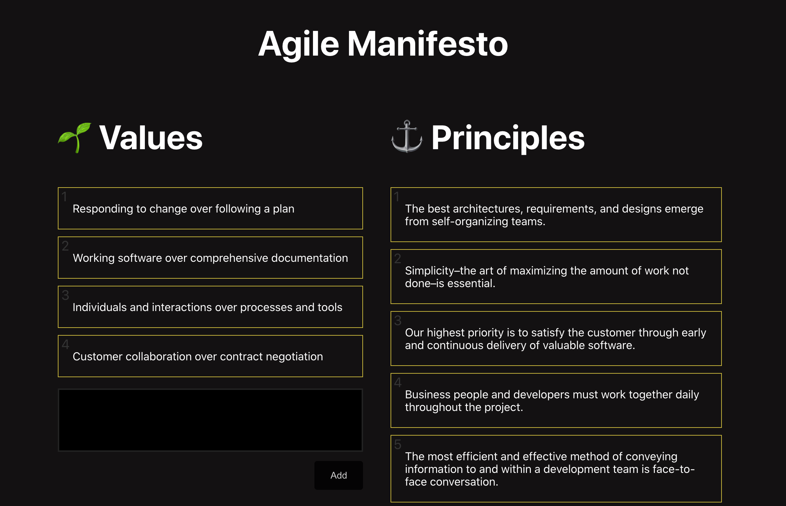

# Agile Manifesto

A react/electron project where users can add, modify and delete agile values and principles

## Available Scripts

This project uses `yarn` as its package manager. Please go to https://classic.yarnpkg.com/en/ for the installation details.

### Before you start

There's an `env.example` file added, please rename it to `.env` in order to get the firebase credentials.

In the project directory, you can run:

### `yarn electron`

Runs the app in electron.\
Will automatically open a desktop app.

### `yarn start`

Runs the app in the development mode.\
Open [http://localhost:3000](http://localhost:3000) to view it in the browser.

The page will reload if you make edits.\
You will also see any lint errors in the console.

### `yarn test`

Launches the test runner in the interactive watch mode.\
See the section about [running tests](https://facebook.github.io/create-react-app/docs/running-tests) for more information.
